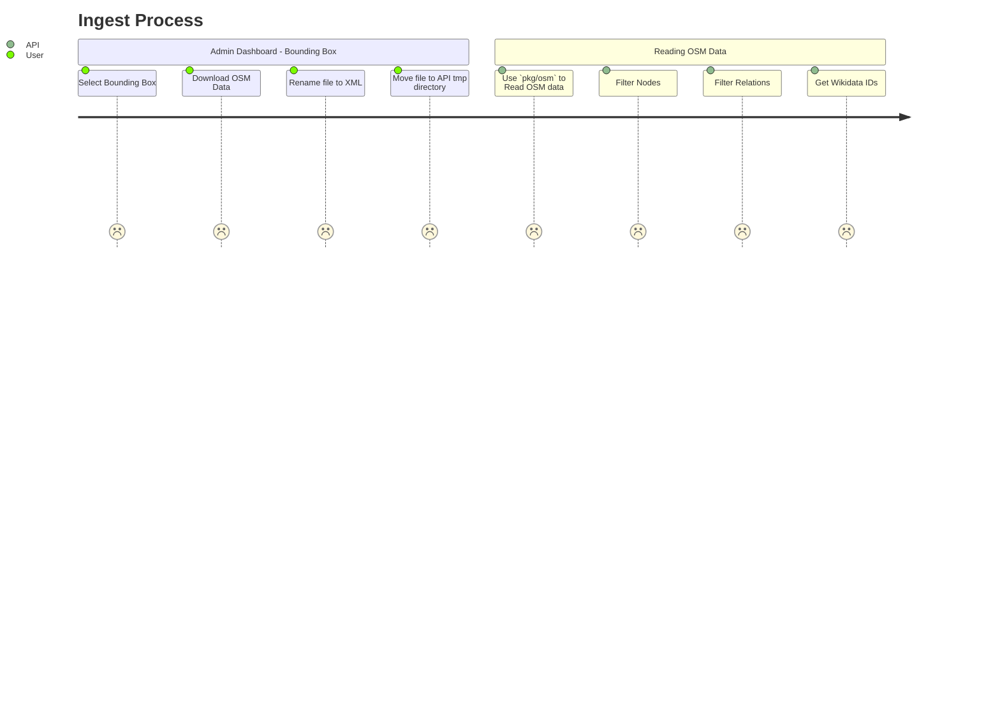
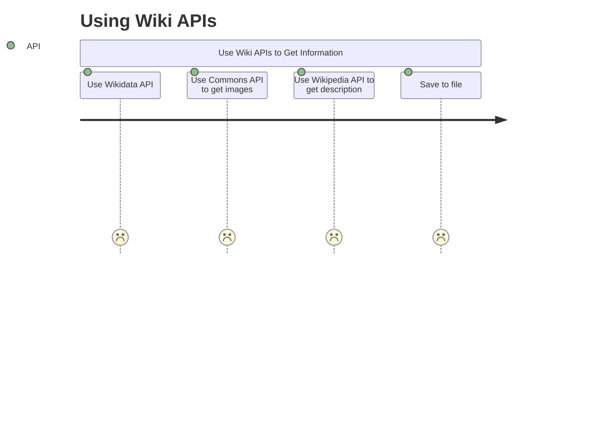

# Ingest

## Ingest process

```mermaid
journey
  title Ingest Process
  section Admin Dashboard - Bounding Box
    Select Bounding Box: 1: User
    Download OSM Data: 1: User
    Rename file to XML: 1: User
    Move file to API tmp directory: 1: User
  section Reading OSM Data
    Use `pkg/osm` to Read OSM data: 1: API
    Filter Nodes: 1: API
    Filter Relations: 1: API
    Get Wikidata IDs: 1: API
```

```mermaid
journey
  title Using Wiki APIs
  section Use Wiki APIs to Get Information
    Use Wikidata API: 1: API
    Use Commons API to get images: 1: API
    Use Wikipedia API to get description: 1: API
    Save to file: 1: API
```
