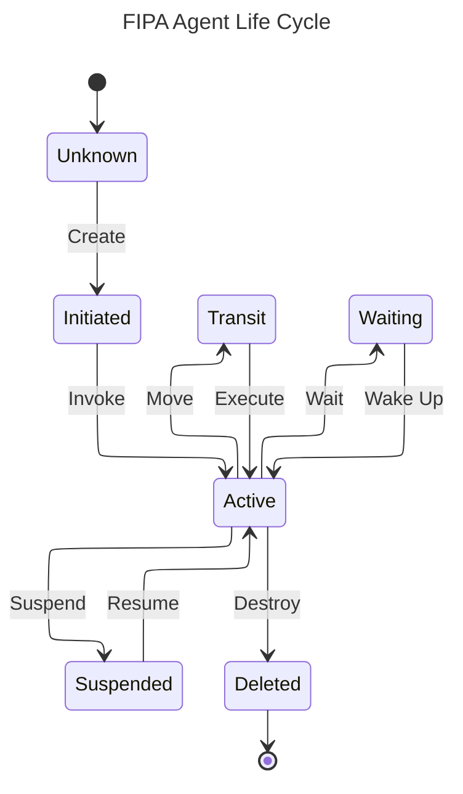
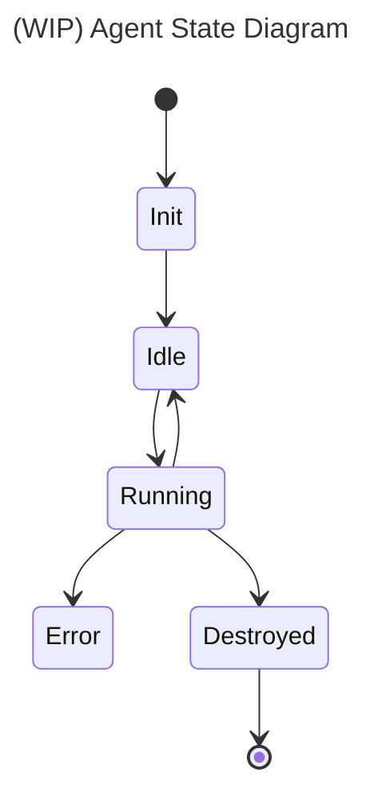

# ADR-0007: Agent Based Simulations

## Status
Accepted

## Context
We can already create relational fake data for our application but we can only do it once when we clean install the application. After the initial database seeding with this fake data generation, everything stays static in development environment and we don't have a way to observe how the application data changes over time from the perspective of a user. We don't get new followers, likes, trip invites; we don't see any changes in the home feed (new, popular, featured, favorite places); and we don't see any new locations being added to the application. This makes it hard to test and observe how the application behaves over time and how it reacts to new data being added.

Agent based simulations (`ABS`) (or agent-based modeling) is a way to simulate the actions and interactions of autonomous agents. As an introduction to the topic, you may want to read the [Wikipedia](https://en.wikipedia.org/wiki/Agent-based_model) entry on this.

Creating agents that simulate user behavior in the application can help us generate a more dynamic development environment — one that changes over time and allows us to observe dynamic parts of our system.

We considered extending the existing fake data generation to support this but it wouldn't allow us to simulate the relational parts of our systems: users following other users, liking reviews, inviting other users to trips, etc.

The authoritative entity on agent development is [FIPA](https://www.fipa.org/), although it looks like they are not active anymore. One of the most popular agent framework is [JADE](https://jade-project.gitlab.io/), which is for Java and the initial inspiration for our ABS implementation.

FIPA's agent life cycle is as follows:

We decided that this many states and transitions are unnecessary for our needs.

We implemented a sketch with [XState](https://stately.ai/docs/xstate). Although it is powerful and feature rich, we find it to be too complex for our needs. We want to keep our agent state and state-transition logic simple and easy to reason about.

In the next iteration, we decided to use [Zustand](https://zustand.docs.pmnd.rs/learn/getting-started/introduction) for the agent state. This worked well (especially with the middlewares), and we were able to implement a simple agent state machine.

Although it may change in the future, our initial agent life cycle is as follows:

Our ABS implementation is not done, it's still a work in progress. We are still exploring the topic and trying to find the best way to adopt various techniques.

When the foundation is ready, we will be able to use custom agents to simulate user behavior in the application. Some of the advantages of this approach are:
- We can simulate user behavior and tune agents to behave in certain ways (e.g., more active users, more social users, etc.).
- We can simulate events that happen over time (e.g., new users joining the application, new locations being added, sending invites, etc.).
- Any request an agent makes goes through the same code paths as a real user request, so we can observe how the application behaves in response to these requests.
- Simulating a large number of users and observing how the application behaves under load.
- Simulating edge cases that are hard to reproduce with real users (e.g., a user sending invites to a large number of other users, a user liking a large number of reviews, etc.).
- Simulating scenarios that are difficult to test manually (e.g., simultaneous actions by multiple users).
- Constantly E2E testing the application with a variable number of users with different characteristics.

## Decision
We started agent based testing with commit `447dbebd60c47636511ddefb4218da7d0b632821`

## Consequences
- Positive:
	- Dynamic data generation in development environment.
	- Better testing and observation of application behavior over time.
	- Constant E2E testing
- Negative:
	- More complexity in the codebase.
