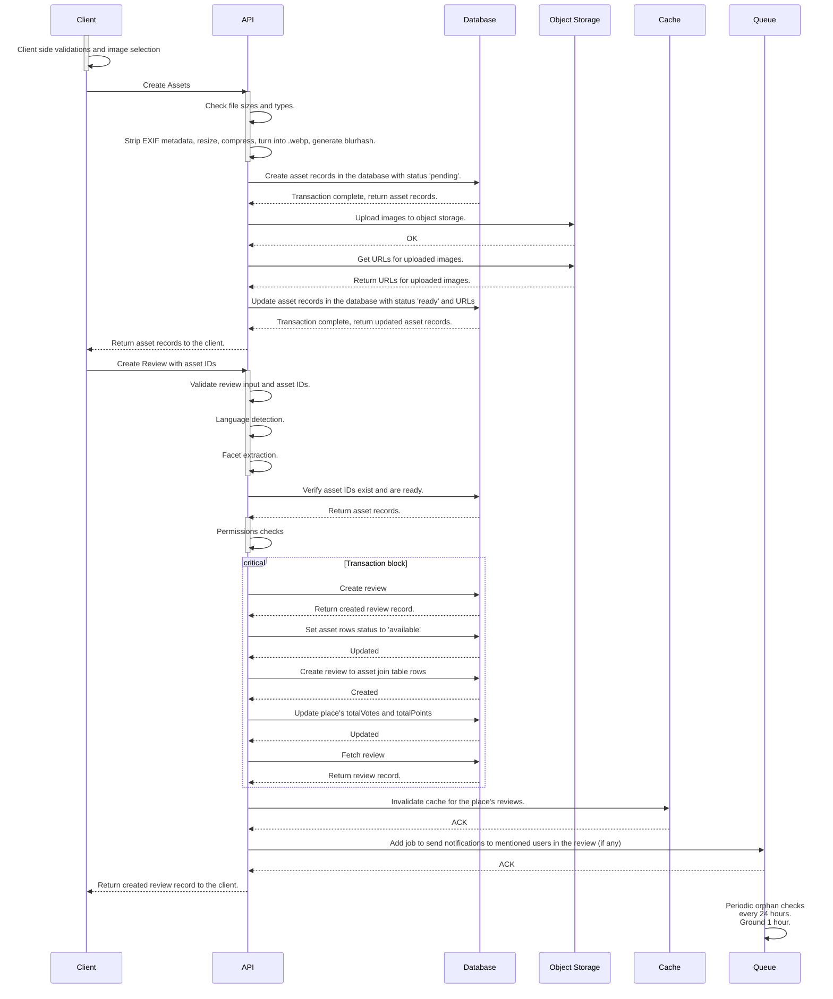

# ADR-0011: Reviews and Assets

## Context
This ADR aims to formalize the reviews feature and asset management of Wanderlust.

### Definitions

Reviews are user-generated content that provide feedback on places. A user may write a review for a place, which includes a rating, a text content, visit date, and optionally images. Reviews are associated with a specific place and a user. Each review may have 0 or more images (up to 4). Users may create, read, and delete their own reviews. Every review is readable by all users (and non authenticated visitors).

Reviews are not editable after creation.

Assets are images uploaded by users for their reviews. In the future, we may allow other usage of assets (such as trip media, chat media, etc.) but at this point, they are only used for reviews. Assets are stored in an object storage service (in local development, we use SeaweedFS), and information about the assets are stored in the database. Each asset is associated with a review and a user. Assets are not editable after creation.

### Assets Table

| Column | Type | Description |
|--------|------|-------------|
| id     | UUID | Unique identifier for the asset. We are using UUIDv4. |
| url    | string | The URL of the asset in the object storage service. |
| bucket | string | The bucket name in the object storage service where the asset is stored. |
| key    | string | The key of the asset in the object storage service. |
| mimeType | string | The MIME type of the asset (e.g., image/webp, image/png). |
| size | int | The size of the asset in bytes. |
| width | int? | The width of the image in pixels. |
| height | int? | The height of the image in pixels. |
| blurhash | string? | Blurhash of the image for placeholder rendering. |
| alt | string? | Alternative text for the image. (A11Y) |
| status | enum[pending, ready, available, failed] | The status of the asset, which can be one of the following:   - pending: record has been created, waiting file to be uploaded to the object storage  - ready: record has been created, file has been uploaded to the object storage, but not yet associated with a place or review  - available: record has been created, file has been uploaded to the object storage, and associated with a place or review   - failed: record has been created, but the file upload to the object storage has failed |
| visibility | enum[public, private] | The visibility of the asset, which can be either public or private. Public assets can be accessed by anyone, while private assets can only be accessed by the owner and authorized users. |
| uploadedBy | string? | The ID of the user who uploaded the asset. If the user is deleted or deactivated, this field may be null. |
| metadata | JSONB? | Additional metadata about the asset, stored as a JSON object. This can include information such as the original filename, EXIF data, or any other relevant details. For reviews, this column remains empty. We don't store metadata information about review assets. |
| attributions | Attribution[] (JSONB) | List of attributions for the asset, stored as a JSON array. Each attribution contains information about the source or creator of the asset. |
| createdAt | timestamp | The timestamp when the asset was created. |
| updatedAt | timestamp | The timestamp when the asset was last updated. |
| deletedAt | timestamp? | The timestamp when the asset was deleted. If the asset is not deleted, this field is null. |

Indices:

| Column(s) | Type | Description |
|-----------|------|-------------|
| id | primary key | Unique identifier for the asset. |
| uploadedBy | B-tree | Index on the uploadedBy column to optimize queries filtering by the user who uploaded the asset. |

Join table for `assets` and `places` (`assets_to_places`):

| Column | Type | Description |
|--------|------|-------------|
| assetId | UUID | Foreign key referencing the `id` column in the `assets` table. |
| placeId | string | Foreign key referencing the `id` column in the `places` table. |
| order | int | The order of the asset in relation to other assets for the same place. This can be used to determine the display order of assets. |

Indices:

| Column(s) | Type | Description |
|-----------|------|-------------|
| assetId, placeId | primary key | Composite primary key on the assetId and placeId columns to ensure uniqueness of the asset-place relationship. |
| placeId, order | Unique | Unique index on the placeId and order columns to ensure that each asset has a unique order within a place. |

Join table for `assets` and `reviews` (`assets_to_reviews`):

| Column | Type | Description |
|--------|------|-------------|
| assetId | UUID | Foreign key referencing the `id` column in the `assets` table. |
| reviewId | string | Foreign key referencing the `id` column in the `reviews` table. |
| order | int | The order of the asset in relation to other assets for the same review. This can be used to determine the display order of assets. |

Indices:

| Column(s) | Type | Description |
|-----------|------|-------------|
| assetId, reviewId | primary key | Composite primary key on the assetId and reviewId columns to ensure uniqueness of the asset-review relationship. |
| reviewId, order | Unique | Unique index on the reviewId and order columns to ensure that each asset has a unique order within a review. |

### Reviews Table

| Column | Type | Description |
|--------|------|-------------|
| id | string | Unique identifier for the review. We are using nanoid. |
| placeId | string | Foreign key referencing the `id` column in the `places` table. (cascade on delete) |
| userId | string | Foreign key referencing the `id` column in the `users` table. (cascade on delete) |
| content | string | The text content of the review. |
| facets | JSONB | A JSON object containing the rich text facets of the review. (See [ADR-0006](./0006.md) for more details on facets) |
| rating | smallint | The rating given by the user in the review. This is an integer value between 1 and 5. ([1,5] range) |
| totalLikes | bigint | The total number of likes the review has received. This is a non-negative integer value. Denormalized from the `review_likes` table. |
| detectedLanguage | string | The detected language of the review content. This is a string value representing the language code (e.g., "en" for English, "es" for Spanish). For language codes, see [ADR-0010](./0010.md) § Standardized Codes |
| visitedAt | timestamp | The date and time when the user visited the place being reviewed. |
| createdAt | timestamp | The timestamp when the review was created. |
| updatedAt | timestamp | The timestamp when the review was last updated. |

Indices:

| Column(s) | Type | Description |
|-----------|------|-------------|
| id | primary key | Unique identifier for the review. |
| placeId | B-tree | Index on the placeId column to optimize queries filtering by the place being reviewed. |
| userId | B-tree | Index on the userId column to optimize queries filtering by the user who wrote the review. |
| placeId, rating | B-tree | Composite index on the placeId and rating columns to optimize queries filtering by the place and rating. |
| placeId, createdAt | B-tree | Composite index on the placeId and createdAt columns to optimize queries filtering by the place and creation date. |
| placeId, totalLikes | B-tree | Composite index on the placeId and totalLikes columns to optimize queries filtering by the place and total likes. |

Check constraints:
| Name | Expression | Description |
|------|------------|-------------|
| rating_range | rating >= 1 AND rating <= 5 | Ensures that the rating is within the valid range of 1 to 5. |
| visited_at_past | visitedAt <= NOW() | Ensures that the visitedAt timestamp is not in the future. |

Review likes table (`review_likes`):

| Column | Type | Description |
|--------|------|-------------|
| reviewId | string | Foreign key referencing the `id` column in the `reviews` table. (cascade on delete) |
| userId | string | Foreign key referencing the `id` column in the `users` table. (cascade on delete) |
| createdAt | timestamp | The timestamp when the like was created. |

Indices:

| Column(s) | Type | Description |
|-----------|------|-------------|
| reviewId, userId | primary key | Composite primary key on the reviewId and userId columns to ensure uniqueness of the like relationship. |
| reviewId | B-tree | Index on the reviewId column to optimize queries filtering by the review being liked. |

## Review and Asset Creation

- A user may create a review for a place.
- A review **must** have:
	- A text content.
	- A rating between 1 and 5.
	- A visitedAt date that is not in the future.
- A review **may** have:
	- Up to 4 images (assets).

If a review is created with assets, the flow is as follows:
1. Client sends a request to upload assets.
2. API validates the assets.
3. API processes the assets (strip EXIF metadata, resize, compress, convert to .webp, generate blurhash)
4. API creates asset records in the database with status `pending`.
5. API uploads the assets to the object storage service and updates asset records in the database with status `ready`.
6. Response is sent to the client with the asset records.
7. Client sends a request to create a review with the required fields (content, rating, visitedAt) and the IDs of the uploaded assets.
8. API validates the input.
9. API runs a language detection function (non-blocking) on the review's text content.
10. API runs a facet extraction function (non-blocking) on the review's text content.
11. API verifies that the asset IDs exist and are ready.
12. API checks permissions to ensure that assets are owned by the user.
13. API creates the review in the database.
14. API updates the asset records in the database to set their status to `available`.
15. API creates the review-to-asset join table records in the database.
16. API updates the place's totalVotes and totalPoints in the database.
17. API fetches the created review from the database.
18. API invalidates the cache for the place's reviews.
19. API adds a job to the queue to send notifications to mentioned users in the review (if any).
20. API returns the created review to the client.

If a review is created without assets, steps 1-6 are skipped, and the flow continues from step 7 except that the assets validation, verification, and management steps (steps 11, 12, 14, and 15) are skipped. Also, on step 7, the client sends an empty array for the asset IDs.

## Request Flow

## User mentions and other rich text facets
Facets feature is described in [ADR-0006](./0006.md).

Username mentions follows the username rules described in [ADR-0009](./0009.md).

## Decision
New review creation flow is implemented with commits:
- Frontend: `84559472be8656af159e199d35d65e70252958d1`
- Bulk uploads: `13402b1f49939cade66d9bbfeeea020f7cfae972`
- Initial backend work: `2f989e31756ef2b6a2fd684d8a46528be3100d6d`

## Consequences
Positive:
- Better asset management.
- Better review create flow.
Negative:
- 2 steps on the client side
Neutral
- We may switch to direct uploads and/or outbox pattern in the future.

## Further reading

## Related ADRs

- [ADR-0006](./0006.md): Rich Text Editor and Facets
- [ADR-0009](./0009.md): Username Rules

## Changelog

- **2026-07-25**: Created
