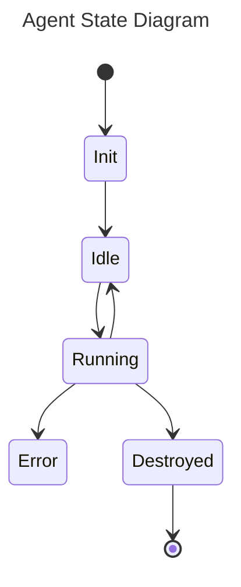

# Agents

You may need [Mermaid](https://mermaid.ai/open-source/intro/) to render the following diagram.

```mermaid
---
title: Agent State Diagram
---
stateDiagram
	[*] --> Init
	Init --> Idle
	Idle --> Running
	Running --> Idle
	Running --> Error
	Running --> Destroyed
	Destroyed --> [*]
```
