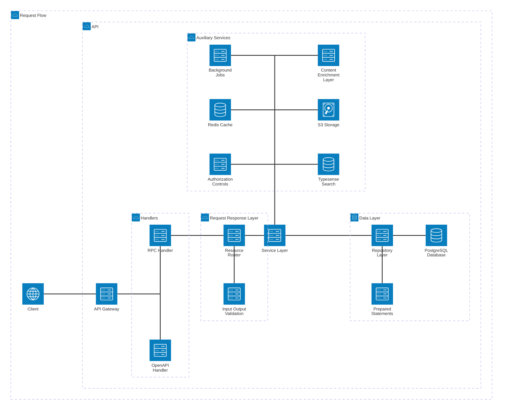

# Architecture

- We are using a monorepo structure to manage multiple applications and shared packages in a single repository.
- We don't particularly follow any specific software architecture style/pattern/principle, but we do apply some concepts from ROD, DDD, vertical slice, tiered (n-layer) architecture:
	- ROD (Resource-oriented Design) (See [ADR-0010](adr/0010.md))
	- You may think of every folder in the `api/src/routes` as a `domain` in DDD.
	- Every route folder follows the VSA pattern, where the folder contains all the files related to a specific feature:
		- `index.ts`: Defines the module (what is exposed to the IoC container) and the router (RPC methods/HTTP handlers).
			- Each RPC method/HTTP handler is a thin layer that performs validation, middleware application, and data extraction and then delegates the request to the service layer.
			- Every RPC method has a corresponding `Input` and `Output` DTO defined in the `contract` package.
			- RPC methods follow the REPR (Request - Endpoint - Response) pattern.
		- `service.ts`: Intermediary layer that is responsible for calling appropriate repository methods and performing additional business logic as needed.
			- Caching
			- Authorization/Permission checks
			- Enqueuing background jobs
			- Content enrichment
		- `authz.ts`: Authorization/Permission checkers
		- `repository.ts`: Repository layer is responsible for interacting with the database and performing CRUD operations.
		- `statements.ts`: Prepared statements for database queries, which are used by the repository layer.
		- `enricher.ts`: Content enrichment layer is responsible for enriching the content with additional data from other sources.
- One of the important rules we follow is the **low coupling, high cohesion** principle.

## Request Flow

## Structure

Related ADRs:
- [ADR-0004](adr/0004.md)
- [ADR-0007](adr/0007.md)

## Code Flow

- You should start reviewing the project by first inspecting the `api` and `web` applications, as they are the main entry points of the project.
- To delve deeper into the backend, you can start inspecting the `db`, `contract`, and `common` packages.
