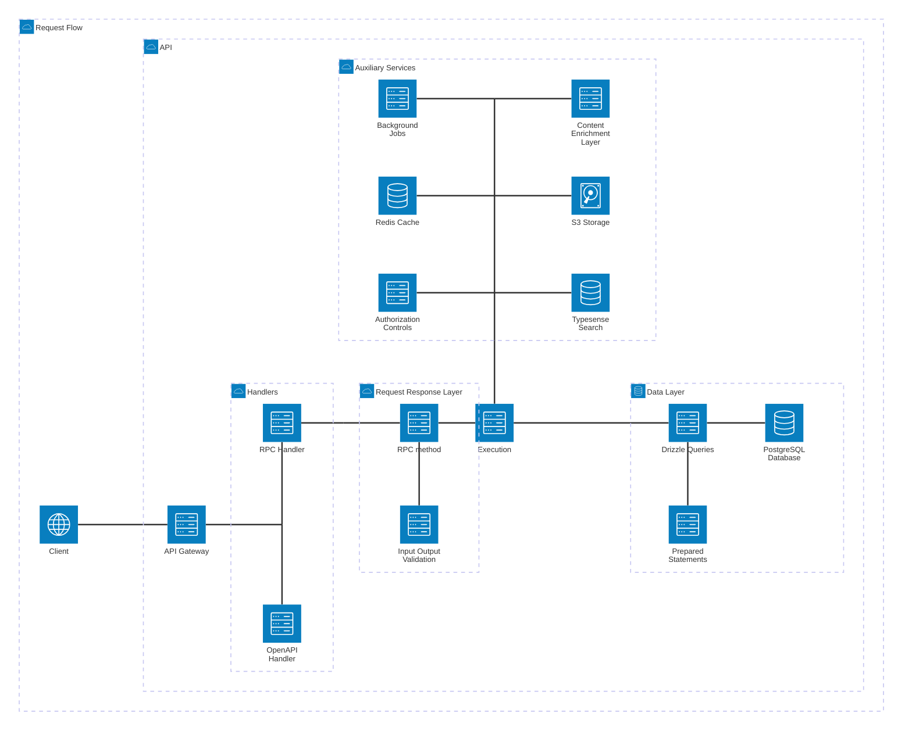

# Architecture

## General
We are using a monorepo structure to manage multiple applications and shared packages that are used across the applications. You may call this a "modular monolith" architecture, although we don't prefer to use that term.

Every package has two major `package.json` scripts: `check-types` and `dev`.
- `check-types`: Runs the TypeScript compiler in `noEmit` mode to check for type errors.
- `dev`: Runs the TypeScript compiler in `watch` mode to compile the package and watch for changes.

During development, running `bun dev` from the monorepo root will build all the packages and start all applications in watch mode. This is the preferred way of running the project in development environment.

There are three architecture style/pattern/principle that we try to follow in our project:
- ROD (Resource-oriented Design) (See [ADR-0010](adr/0010.md))
- Vertical Slice Architecture (VSA)
- Low Coupling, High Cohesion

## API

Inside the `routes` directory, every feature has its own folder, which contains all the files related to that feature. Example using the `trips` feature:

```mermaid
treeView-beta
trips/ ## Feature directory
	methods/ ## RPC methods. You may create subdirectories as needed but try to avoid it first.
		comments/
		invites/
		locations/
		participants/
		create.ts ## Anything required for creating a trip (oRPC, service, persistence, jobs, cache, etc.) lives here.
		delete.ts
		get.ts
		leave.ts
		list.ts
		summary.ts
		update.ts
	provides/ ## Public surface of this feature. You may use the classes defined here in other features.
		comment.ts
		invite.ts
		location.ts
		trip.ts
	internal/ ## Internal files for this feature. You may not use the classes defined here in other features.
		authz.ts
		cache.ts
		router.ts
	index.ts ## Entry point for this feature. It defines the module.
```

`index.ts`: Entry point for this feature. You **must** export all the **methods** and **providers** in the module definition.

`methods/`: All the RPC methods are added here. Each method has its own file. Anything required to fulfill the request (oRPC handler, database, cache, background jobs, providers from this and other features) must be defined in this file. 

You may create subdirectories inside the `methods` directory if you have a lot of methods, but try to avoid it first. Each method should be self-contained and should not depend on other methods.

`provides/`: Public surface of this feature. You may use the classes defined here in other features. These classes may be used in multiple methods in this feature or in other features. This directory is optional.

`internal/`: Internal files for this feature. You **must not** use the classes defined here in other features. These classes are only used in this feature and should not be exposed to other features.

- Each RPC method/HTTP handler (`route` method of the class) is a thin layer that performs validation, middleware application, and data extraction and then delegates the request to some other method in the same class.
- Every RPC method has a corresponding `Input` and `Output` DTO defined in the `contract` package.
- RPC methods follow the REPR (Request - Endpoint - Response) pattern.

Common files inside the `internal` directory:
- `authz.ts`: Authorization/Permission checkers. (See [Authorization](./auth.md) section)
- `cache.ts`: Cache options and cache key generators.
- `router.ts`: Contract implementation.
- `statements.ts`: Prepared statements for database queries.

## Request Flow

```mermaid
architecture-beta
	group all(cloud)[Request Flow]

	service client(internet)[Client] in all

	group api(cloud)[API] in all

	service gateway(server)[API Gateway] in api
	junction split in handlers

	group handlers(cloud)[Handlers] in api

	group reqres(cloud)[Request Response Layer] in api

	service rpc(server)[RPC Handler] in handlers
	service openapi(server)[OpenAPI Handler] in handlers

	junction join in api
	service router(server)[RPC method] in reqres
	service validation(server)[Input Output Validation] in reqres
	service svc(server)[Execution] in api

	group svcaux(cloud)[Auxiliary Services] in api

	service authz(server)[Authorization Controls] in svcaux
	service cache(database)[Redis Cache] in svcaux
	service search(database)[Typesense Search] in svcaux
	service storage(disk)[S3 Storage] in svcaux
	service jobs(server)[Background Jobs] in svcaux
	service enricher(server)[Content Enrichment Layer] in svcaux
	junction svcjoin1 in svcaux
	junction svcjoin2 in svcaux
	junction svcjoin3 in svcaux

	group datalayer(database)[Data Layer] in api

	service repo(server)[Drizzle Queries] in datalayer
	service statements(server)[Prepared Statements] in datalayer
	service pg(database)[PostgreSQL Database] in datalayer

	client:R -- L:gateway
	gateway:R -- L:split

	split:T -- B:rpc
	split:B -- T:openapi

	rpc:R -- L:join

	join:R -- L:router
	validation:T -- B:router
	router:R -- L:svc
	svc:R -- L:repo
	repo:R -- L:pg
	statements:T -- B:repo

	authz:R -- L:svcjoin1
	search:L -- R:svcjoin1

	cache:R -- L:svcjoin2
	storage:L -- R:svcjoin2

	jobs:R -- L:svcjoin3
	enricher:L -- R:svcjoin3

	svcjoin1:B -- T:svc
	svcjoin2:B -- T:svcjoin1
	svcjoin3:B -- T:svcjoin2

```

## Monorepo Structure

```mermaid
treeView-beta
apps/ ## runnable applications
	abs/ ## Agent Based Simulation application
	admin/ ## Admin panel for managing users, content, and other administrative tasks
	api/ ## Core backend API
	cli/ ## Command-line interface for various tasks and utilities
	fake/ ## Fake data generation CLI tool
	web/ ## Frontend web application
	wiop/ ## IPX image optimization service
packages/ ## shared packages
	auth/ ## Shared authentication package
	cache/ ## Shared cache and Redis package
	common/ ## Shared common utilities, types, and DTOs package
	config/ ## Shared configuration package
	contract/ ## Shared oRPC contract package for API and frontend communication
	db/ ## Shared database package for Drizzle ORM tables, relations, and partial queries
	email/ ## Shared email package for sending emails
	jobs/ ## Shared jobs package for background jobs and task scheduling
	richtext/ ## Shared rich text package for manipulating rich text content
	search/ ## Shared Typesense search service
	storage/ ## Shared storage package for file uploads and management
	ui/ ## Shared UI components package (ShadCN UI)
	uid/ ## Shared unique ID generation package
```

Related ADRs:
- [ADR-0004](adr/0004.md)
- [ADR-0007](adr/0007.md)

## Code Flow

- You should start reviewing the project by first inspecting the `api` and `web` applications, as they are the main entry points of the project.
- To delve deeper into the backend, you can start inspecting the `db`, `contract`, and `common` packages.

